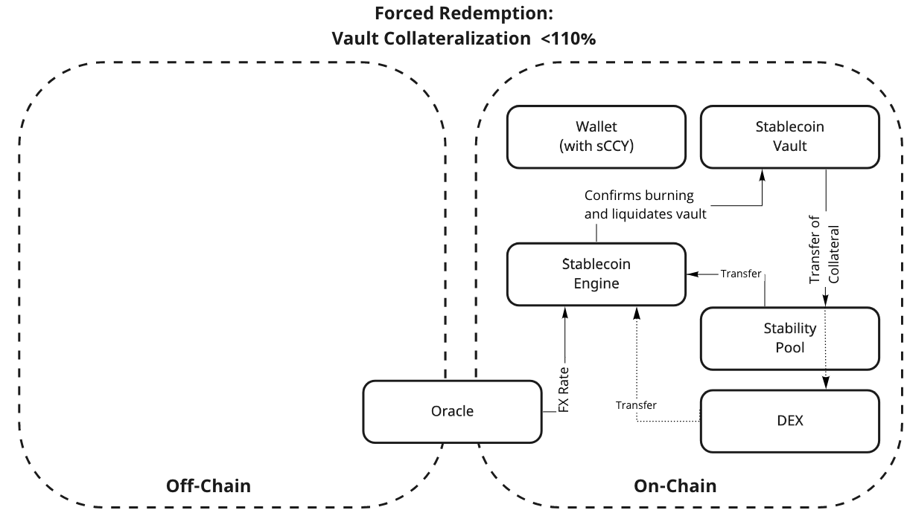

# Minting and Redemption Process

The minting and voluntary redemption processes for Swiss Stable Coin sCCY follow the general process of on-chain collateralized stablecoins. The innovation is applied in the forced redemption processes.

## Minting

The Protocol gives a loan for a specified period of time to sCCY creators, who provide collateral as a security. The process is depicted in the figure.

## Redemption

The Stablecoin creator returns the loan inclusive interest rates and gets his collateral back. The process of the voluntary redemption is depicted in the figure.

The processes of the forced redemption are depicted in the figure (vault collateralization is below 110%) and (overall collateralization of the Protocol is below 150% and the vault collateralization is below 150%).

#### 

#### Algorithm 1: Algorithm for Compulsory Redemption of Under-collateralized Vault

Loss ←value of stablecoins owned by the User; if StabilityeP ool ≥ Loss then

Pay back the Loss from the Stability Pool (burn sCCY coins).;

Distribute the collateral between the Stability Pool members;

else if collateral is volatile then

exchange the collateral into less volatile collateral at the DEX;

end

sell collateral (or less volatile) collateral at the DEX via auction; if StabilityP ool + AuctionRevenue ≥ Loss then

Pay back the Loss from the Stability Pool and the auction revenue (burn sCCY coins);

Distribute the remaining revenue to the Reserve Pool;

else if StabilityP ool + AuctionRevenue + ReserveP ool ≥ Loss then

Pay back the Loss from the Stability Pool, the auction revenue and reserve pool (burn sCCY coins);

Distribute the remaining revenue to the Reserve Pool;

else

Sell SSN tokens on DEX debt auction against sCCY; Amount of SSN tokens required by the auction needs to be newly minted; Pay back the Loss using debt auction revenue (burn sCCY coins).

end end

end

#### 

#### Algorithm 2: Algorithm for Compulsory Redemption Process of Overall Under-

collateralization

Loss ←value of stablecoins owned by the User; if StabilityeP ool ≥ Loss then

Pay back the Loss from the Stability Pool (burn sCCY coins); Distribute the collateral to the Creator (value over 110%) and to the Stability Pool

members (up to 110%);

else if collateral is volatile then

exchange the collateral into less volatile collateral at the DEX;

end

sell collateral (or less volatile) collateral at the DEX via auction; if StabilityP ool + AuctionRevenue ≥ Loss then

Pay back the Loss from the Stability Pool and the auction revenue (burn sCCY coins); Distribute the remaining revenue to the Creator (value over 110%) and to the Reserve

Pool (remaining part);

else if StabilityP ool + AuctionRevenue + ReserveP ool ≥ Loss then

Pay back the Loss from the Stability Pool, the auction revenue and reserve pool (burn sCCY coins);

Distribute the remaining revenue to the Reserve Pool;

else

Sell SSN tokens on DEX debt auction against sCCY; Amount of SSN tokens required by the auction needs to be newly minted; Pay back the Loss using debt auction revenue (burn sCCY coins).

end end

end
